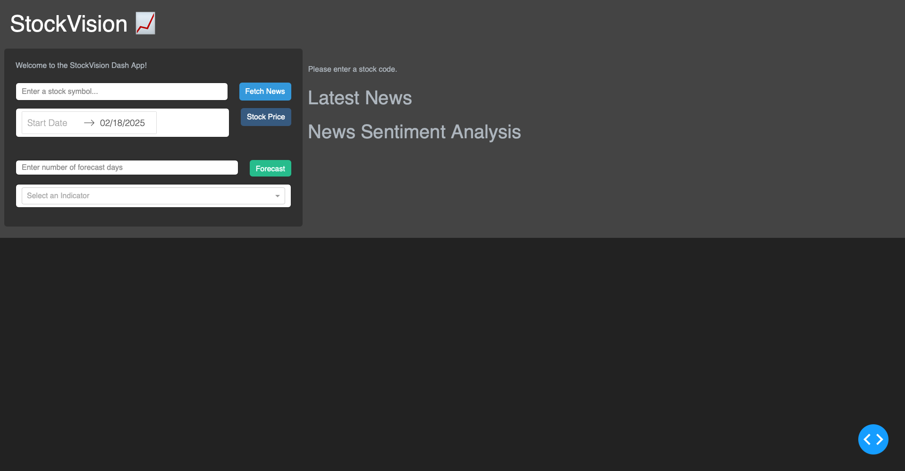
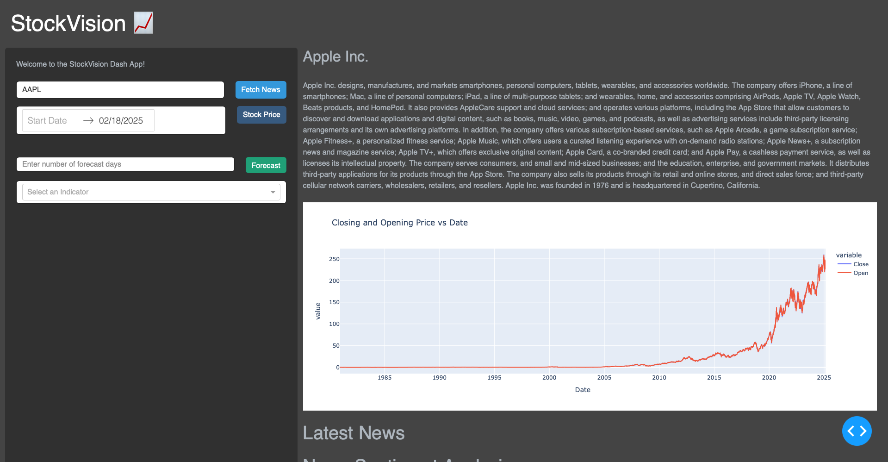
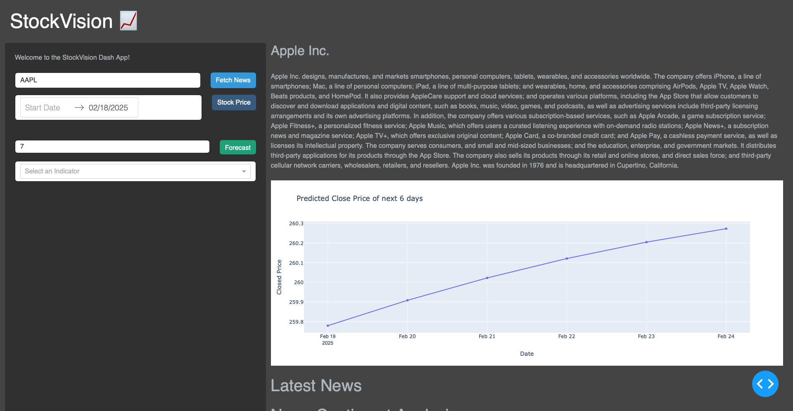
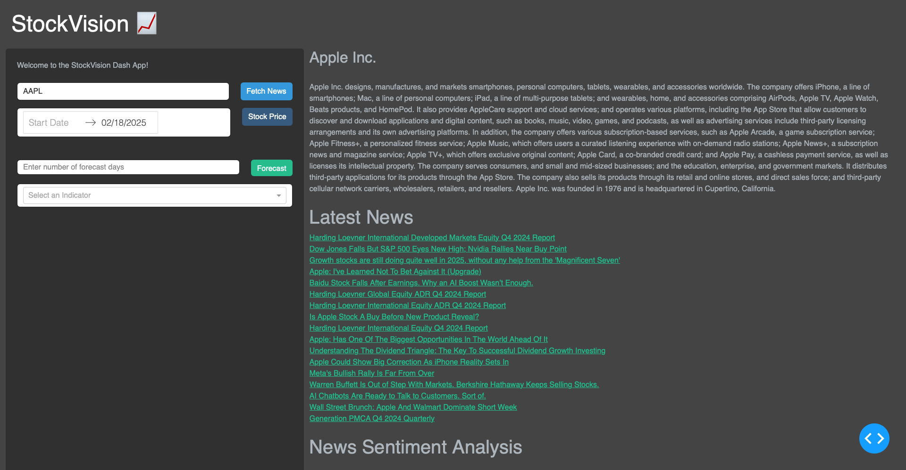
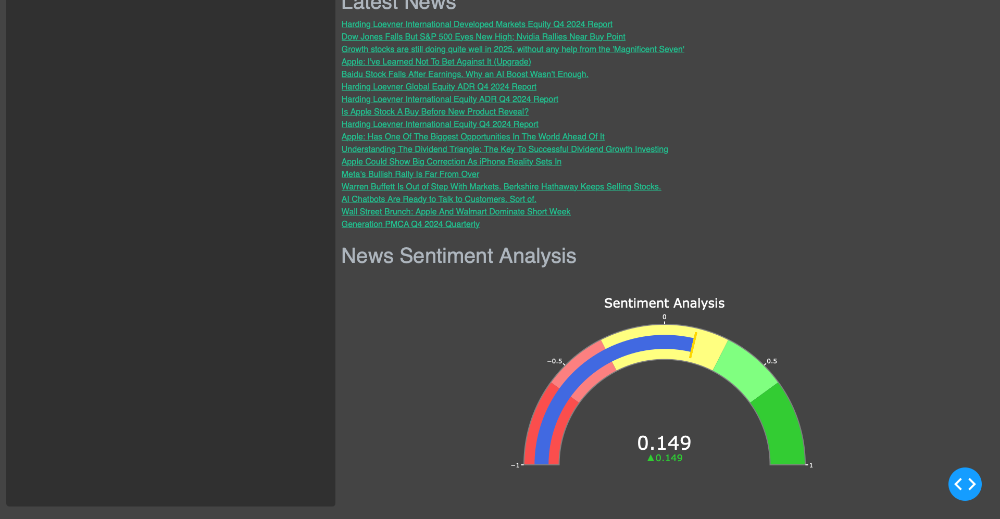

## StockVision 📊  
A Machine Learning & Sentiment Analysis-based Dashboard for analyzing stock trends, forecasting future prices, and monitoring market sentiment.

### **Homepage**
Shows the input section, stock details, graph visualization, latest news and news sentiment analysis.

### **Stock Details**
Typing a Stock code will Display the stock information and clicking on the stock price will display the price trends.

### **Technical Indicators**
Select RSI, MACD, or Bollinger Bands for stock analysis.

### **Forecasting Stock Prices**
Predict future stock trends using machine learning. 

### **Latest News on Selected Stock**
Get real-time news headlines related to the stock.

### **Sentiment Analysis Based on News**
Analyze market sentiment using AI-powered news insights.  
This feature fetches the latest stock-related news and uses **VADER Sentiment Analysis** (Natural Language Processing) to determine whether the sentiment is **positive, neutral, or negative**.  

#### **📊 Sentiment Gauge**
- A **gauge meter** visually represents the sentiment score.
- **Ranges from -1 to 1**:
  - 🔴 **Negative Sentiment (-1 to -0.3)** → Bearish Market 🐻
  - 🟡 **Neutral Sentiment (-0.3 to 0.3)** → Uncertain Market ⚖️
  - 🟢 **Positive Sentiment (0.3 to 1)** → Bullish Market 🐂
- The gauge dynamically updates based on **real-time news sentiment**.

